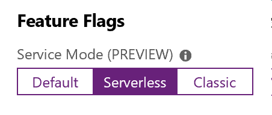

Part of the Serverless Azure-based .Net 2.0 Standard Broadcast solution.
See this [client library repository](https://github.com/bitfox-git/azurebroadcast-client) for more.

[](https://dev.azure.com/bitfox/AzureBroadcast.Functions/_build/latest?definitionId=4)

# Bitfox.AzureBroadcast.Functions 

These Azure Functions are part of the Bitfox.AzureBroadcast feature and should be used in combination with a Azure SignalR service in Serverless mode and the Bitfox.AzureBroadcast.Client for easy broadcasting in .Net 2.0 Standard solutions. For example: Desktop applications (WPF/WinForms) in need of an easy interclient communication, comparable with UDP broadcasting on a local network.

## Sample usage

In any .Net 2.0 Standard solution:

``` csharp
    var client = new BroadcastClient<string>('endpoint-of-azure-functions');

    client.onMessage = (msg) => { 
        //do something usefull with received messages;

    }

    client.Start();
    client.Broadcast("Hello World!");

```` 

## Requirements

### Setup an Azure SignalR service

1. Create service in Azure Portal

2. Change Feature Flag 



3. Copy and save the service endpoint in settings/key menu for later use.

### Setup an Azure Functions endpoint

4. Use the Azure portal to setup an Azure Function.
5. Within the created Azure Function navigate to Platform Features / Application Settings. 
6. Add new Application Setting with the name `AzureSignalRConnectionString` and the value of the Azure SignalR endpoint as recorded in step 3. 


## Deploy a release

Use the latest release on Github tab releases to get the precompiled functions as zip. 
Upload the zipfile in the Azure Portal.


## Build and Deploy of the Azure Function

Clone this repo. You will need .net 2.x SDK for building.

```
dotnet restore
dotnet build
dotnet publish --configuration Release
``` 

### Deployment options

1. Deploy from Visual Studio Code

Install the Azure Functions extension, this allows easy deployment directly from vs-code.

2. Zip the publish folder and use the Azure portal to upload the zip. 

3. Use the `Get publish profile` option in the overview page of the Azure Function in the Azure Portal. Publish with MSDeploy.

## Test your deploy

Go to the Azure Portal Function
Go to the negotiate function 
Supply a header `x-ms-signalr-userid` and Run the request.
You should get an JSON with URL and Token.

